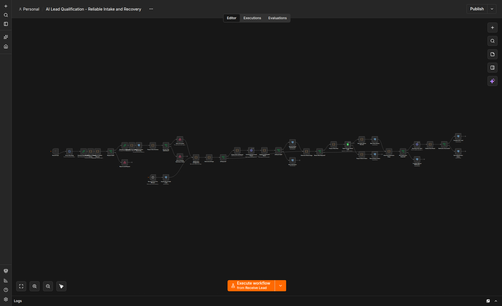
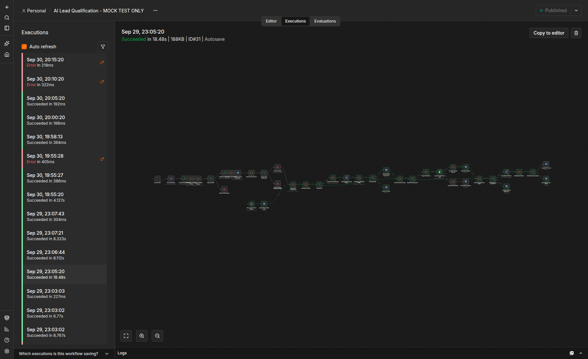
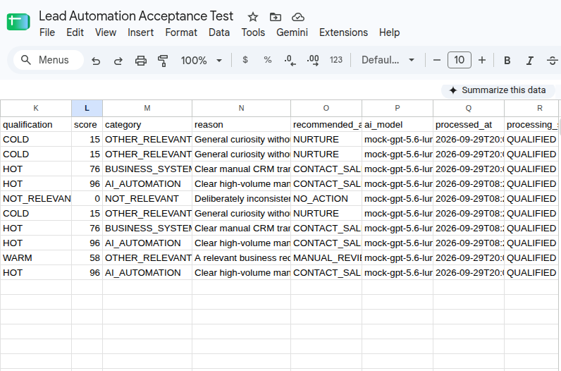
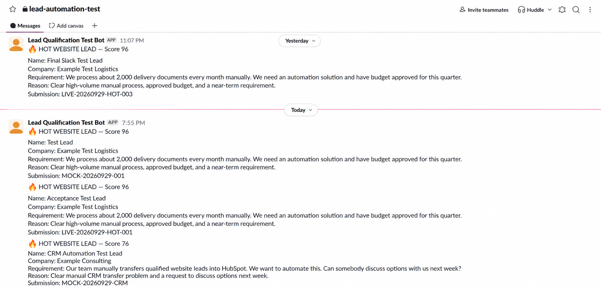
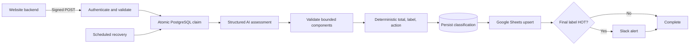

# Reliable AI Lead Qualification Automation

[](https://github.com/yosissac/reliable-ai-lead-qualification/actions/workflows/ci.yml)
[](LICENSE)
[](https://n8n.io/)
[](https://www.postgresql.org/)

A production-minded, open-source reference implementation for securely
receiving website leads, obtaining a structured AI assessment, recording the
result in Google Sheets, and notifying Slack only for high-priority leads.

This project is deliberately more than a happy-path automation. It explores a
central engineering question:

> How can a probabilistic language-model component participate in a reliable,
> auditable business workflow without becoming the uncontrolled authority for
> validation, state, retries, or external side effects?

The repository is intended both as an implementation template for automation
engineers and as a reproducible engineering study of LLM-assisted workflow
reliability.

## Demonstration

| Workflow architecture | Successful end-to-end execution |
|---|---|
|  |  |

| Google Sheets outcomes | HOT-lead Slack notifications |
|---|---|
|  |  |

The model leg in the demonstrated execution used the included
Responses-compatible simulator. Google Sheets and Slack were exercised through
real test integrations with synthetic lead data. This is not represented as a
live OpenAI model evaluation or a production customer deployment. See
[Evidence and claim boundaries](docs/research-and-evaluation.md#evidence-and-claim-boundaries).

## What It Demonstrates

### Industry engineering

- authenticated HMAC-SHA256 webhook intake with timestamp/replay controls;
- validation before model cost or downstream side effects;
- atomic PostgreSQL claims for concurrency-safe duplicate handling;
- distinction between an exact duplicate and an ID/content conflict;
- strict structured model output with bounded scoring components;
- deterministic calculation of total score, final label, and action;
- minimal-data model input that omits unnecessary direct contact details;
- Google Sheets append-or-update by stable submission ID;
- HOT-only Slack notifications with a stable message identity;
- durable stage tracking and recovery without deliberately repeating completed
  external work;
- retryable, permanent/configuration, and invalid-output error classes;
- Dockerized setup, automated tests, evidence reports, and operator manuals.

### Research and academic potential

- an explicit separation between probabilistic inference and deterministic
  control logic;
- a documented threat model and failure taxonomy;
- reproducible simulator-based experiments without paid API access;
- declared internal, construct, and external-validity limits;
- testable hypotheses around idempotency, retry safety, structured-output
  containment, privacy minimization, and human/model agreement;
- a roadmap for real-model robustness, calibration, fairness, cost, and latency
  evaluation.

## Architecture



PostgreSQL is the processing source of truth. Google Sheets is the
business-facing register. n8n orchestrates the stages and keeps credentials
outside the exported workflow.

## Reliability Model

```text
same ID + same content      -> duplicate
same ID + different content -> conflict
same ID + active lease       -> already processing
expired retryable failure    -> resumable
credential/configuration     -> permanent; operator action
successful but invalid output -> quarantined; no blind retry
```

The model supplies semantic judgments, including relevance and bounded
component scores. Application code validates those values and deterministically
derives the total, qualification, and recommended action. This constrains model
authority; it does not make the assessment independent of the model.

## Quick Start

Requirements: Docker Compose v2 and Node.js 20+.

```bash
cp .env.example .env
# Replace every REPLACE_ME value locally. Never commit .env.
docker compose config
docker compose --profile mock-openai up -d

npm test
npm run validate
```

The local stack binds n8n to `127.0.0.1:5678`. The simulator remains inside the
Docker network and never calls OpenAI.

Follow the [technical integration manual](docs/technical-integration-manual.md)
before importing or publishing a workflow. Production activation requires
client-owned credentials, HTTPS ingress, backups, monitoring, retention rules,
and a final live-model smoke test.

## Verification

The productization suite currently contains 13 automated tests covering:

- input validation and canonicalization;
- HMAC verification and replay rejection;
- provider failure classification;
- deterministic outcome mapping;
- HOT/WARM/COLD behavior;
- duplicates and changed-payload conflicts;
- malformed model output;
- Sheets and Slack recovery invariants;
- simulator authentication, response shape, and deliberate failures.

```bash
npm test
# tests 13, pass 13, fail 0
```

Detailed evidence is under [`evidence/`](evidence/). Evidence reports distinguish
live local execution, real test integrations, deterministic simulation, and
unproven production boundaries.

## Repository Map

```text
.
├── workflows/             inactive production workflow export
├── db/init/               PostgreSQL schema and least-privilege grants
├── mock-services/openai/  local Responses-compatible simulator
├── scripts/               validation, signing, and request helpers
├── tests/                 behavior tests and synthetic fixtures
├── docs/                  technical, user, research, and security material
├── evidence/              sanitized verification reports
└── assets/                privacy-reviewed visual proof
```

## Documentation

- [Technical integration manual](docs/technical-integration-manual.md)
- [Business user manual](docs/user-manual.md)
- [Research and evaluation framework](docs/research-and-evaluation.md)
- [Reproducibility guide](docs/reproducibility.md)
- [Threat model](docs/threat-model.md)
- [Design decisions](docs/design-decisions.md)
- [Engineering case study](docs/case-study.md)
- [Evidence and visual provenance](docs/visual-evidence.md)
- [Roadmap](ROADMAP.md)

## Responsible Use

This repository is an engineering reference, not a guarantee of model quality,
legal compliance, or exactly-once delivery across third-party systems. Before
using it for consequential decisions, define a human-review policy, measure
model performance on representative data, examine bias and error costs, and
establish privacy, retention, monitoring, and incident controls.

## Contributing and Citation

Issues and focused pull requests are welcome. Read [CONTRIBUTING.md](CONTRIBUTING.md)
and [SECURITY.md](SECURITY.md) first. Citation metadata is provided in
`CITATION.cff` so academic and engineering reuse can be attributed consistently.

Developed and maintained by [Yoseph Issac](https://github.com/yosissac) as an
open engineering portfolio and a foundation for further research into reliable
LLM-assisted automation.

## License

MIT. See [LICENSE](LICENSE).
